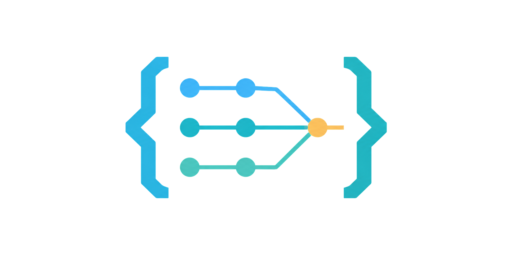

<p align="center">
  
</p>

<h1 align="center">Brace</h1>

<p align="center">
  <strong>Branch-Safe Repository Agent Coordination Engine.</strong><br>
  <em>Controlled agent workflows, from plan to merge.</em>
</p>

<p align="center">
  
  
  
  
</p>

---

Brace turns a structured project description into coordinated agent work. It plans the project, runs independent tasks in isolated Git worktrees, integrates each result through a pull request, audits the completed implementation, fixes the frozen bug set, validates the final branch, and merges it.

The coordinator is deterministic: agents propose and implement; Brace owns state, scheduling, Git, pull requests, retries, reconciliation, and cleanup.

## Why Brace

- **Branch-safe parallelism** — every task, bug, and approved amendment gets its own worktree and branch.
- **Provider-backed integration** — changes reach the integration branch through verified GitHub or Azure DevOps pull requests.
- **Durable recovery** — exact commits, pull requests, hashes, assignments, and results are persisted for restart.
- **Bounded autonomy** — operational failures retry within limits; semantic scope decisions return to the user.

## How it works

```text
requirements.md
      │
      ▼
 planning ───────► plan.md + tasks.json
      │
      ▼
   build ────────► TASK worktrees ─► task PRs ─► brace/integration
      │
      ▼
   audit ────────► bugs.json ──────► BUG worktrees ─► bug PRs
      │
      ▼
final validation ─► project PR ─► main ─► cleanup
```

| Stage | Agents | Durable output | Completion condition |
| --- | --- | --- | --- |
| Planning | Planner | `plan.md`, `tasks.json`, planning summary | Every active requirement has a valid task |
| Build | Builders and verifier | Task commits, PR identities, build summary | Every active task is verified and integrated |
| Audit | Auditor, bug fixers, and verifier | `bugs.json`, fix commits, audit summary | Every finding is resolved and final validation passes |

Agents never communicate directly. Brace gives each agent one immutable assignment and carries its schema-validated result to the next role.

## Quick start

### Requirements

- [uv](https://docs.astral.sh/uv/) 0.12.9 or newer
- Git
- Authenticated [Codex CLI](https://github.com/openai/codex)
- Authenticated GitHub CLI (`gh`), or Azure CLI (`az`) with the Azure DevOps extension
- Configured Git `user.name` and `user.email`

Install Brace as an isolated command-line tool:

```bash
uv tool install git+https://github.com/Kmac907/Brace.git
```

For local development, run `uv tool install .` from a Brace checkout.

### 1. Add Brace to a project

```bash
brace init
```

Brace asks whether the project is new or already exists. For unattended setup:

```bash
# Existing repository
brace init --existing-repository-path /path/to/repository

# New GitHub repository
brace init \
  --project-name example \
  --parent-directory /projects \
  --provider github
```

An existing repository must be clean, checked out on its remote default branch, exactly synchronized with `origin`, and must not already contain `.codex`. Existing project documentation is preserved.

`brace init` runs with your account permissions and can create repositories and push commits. Pin the installation URL to a reviewed tag or commit when reproducibility matters.

### 2. Write the requirements

Use `REQUIREMENTS-PROMPT.md` to turn the project idea into the generated `requirements.md` template. Review the result before planning.

### 3. Plan

```bash
brace plan
```

Planning reads the repository and `requirements.md`. If essential information is missing, it asks in the same terminal, incorporates the answers, and retries. It then writes and validates `plan.md`, the dependency graph, requirement coverage, and `.codex/tasks.json`.

Planning stops before implementation so you can review `plan.md`, `.codex/tasks.json`, and `.codex/planning-summary.json`.

### 4. Build

```bash
brace build
```

The build loop reconciles persisted work, selects dependency-ready non-conflicting tasks, and runs up to `maximumConcurrentBuilders` agents. Each verified task is integrated into `brace/integration` through a provider pull request. No command is required per task.

### 5. Audit and finish

```bash
brace audit
```

The audit loop reviews the exact integration commit once, freezes its findings in `.codex/bugs.json`, and runs up to `maximumConcurrentFixers` independent fixes. After all findings are verified, Brace validates the final integration branch, merges the project pull request, and removes owned worktrees and branches.

## Git model

```text
main
└── brace/integration
    ├── worktree/TASK-0001
    ├── worktree/TASK-0002
    ├── worktree/BUG-0001
    └── worktree/AMEND-0001
```

Worktrees live outside the project by default:

```text
<system-temp>/brace/<repository-id>/
├── TASK-0001/
├── BUG-0001/
└── AMEND-0001/
```

Before publishing or accepting work, Brace verifies the repository, branch, base commit, result commit, changed paths, provider repository, pull-request head and base, and merge result.

## State and recovery

```text
.codex/
├── state.json
├── tasks.json
├── bugs.json
├── planning-summary.json
├── build-summary.json
├── audit-summary.json
├── assignments/
├── results/
└── logs/
```

Only the coordinator writes live state and ledgers. State uses atomic replacement; assignment and result records are immutable. Rerun the same stage after a recoverable interruption. Brace reconciles recorded worktrees, branches, commits, and pull requests before retrying.

Before each critical transition, Brace also checks:

- repository and provider identity;
- workflow configuration and target-branch baseline;
- requirements, plan, task, and bug hashes;
- integration history against accepted pull-request merge commits;
- exact assignment and result identities.

Unknown drift stops the workflow instead of being adopted silently.

## Semantic decisions

Authentication, provider outages, timeouts, dirty worktrees, and malformed results are operational failures. Brace retries them within configured limits or stops with a concrete diagnostic.

Missing requirements, contract conflicts, scope gaps, task decomposition, and bug disposition are semantic decisions. Brace pauses new scheduling, asks the project-manager agent for evidence-backed options, presents the recommendation to the user interactively, and proceeds only from the selected response.

An approved contract amendment receives its own `worktree/AMEND-NNNN` branch and provider pull request. Integrated tasks stay immutable; new scope becomes new follow-up tasks. Scope added during audit returns the workflow to build and requires a fresh audit.

## Configuration

Edit `.codex/workflow.json` before planning begins. Brace freezes it when workflow state is created.

| Setting | Purpose |
| --- | --- |
| `provider` | `github` or `azure_devops` |
| `targetBranch` | Final project pull-request target |
| `integrationBranch` | Coordinator-owned integration branch |
| `maximumConcurrentBuilders` | Parallel task limit |
| `maximumConcurrentFixers` | Parallel bug-fix limit |
| `maximumTaskAttempts` | Retry limit per task |
| `maximumBugAttempts` | Retry limit per bug |
| `maximumPlanningQuestionRounds` | Interactive planning limit |
| `maximumAmendmentRounds` | Semantic amendment limit |
| `agentTimeoutMinutes` | Deadline for one Codex role |
| `agentCleanupGraceSeconds` | Process-tree cleanup grace |
| `worktreeRoot` | Optional external worktree root |
| `deleteMergedBranches` | Delete verified merged branches |

Changing frozen configuration is treated as drift.

## Start another workflow

After a workflow reaches completion, update and commit `requirements.md`, then run:

```bash
brace plan --start-new-workflow
```

Brace replaces completed ledgers only after verifying the previous final merge and cleanup.

## Troubleshooting

- **Broken installation** — reinstall Brace with `uv tool install --force git+https://github.com/Kmac907/Brace.git`.
- **Authentication failure** — repair the Codex, Git, `gh`, or `az` session and rerun the same stage.
- **Dirty worktree** — preserve or commit the reported files; Brace never discards them.
- **Unknown integration commit** — reconcile the unowned commit or pull request before resuming.
- **Stale pull request** — close or correct the PR whose head or base differs from the persisted assignment.
- **Attempts exhausted** — inspect the persisted result and blocker; Brace does not fabricate completion.

## Development

```bash
uv sync --locked
uv run python -m compileall -q src tests
uv run python -m unittest discover -s tests -v
uv run brace --help
uv build --no-sources
```

Tests use temporary local Git repositories and mocked provider and agent boundaries. They do not create remote pull requests.

## License

Copyright © 2026 Kmac907. Brace is licensed under the [GNU General Public License version 3](LICENSE).
